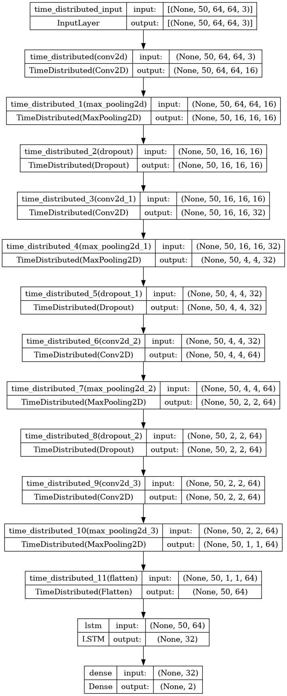
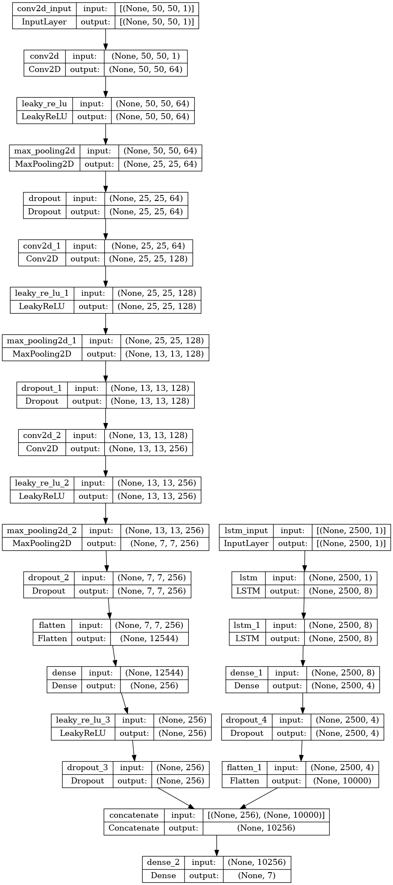
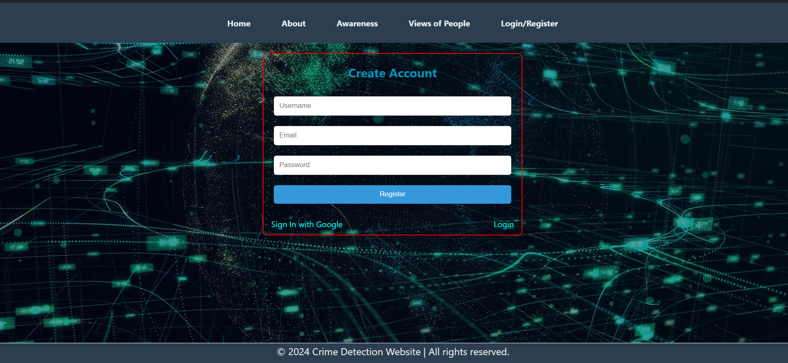
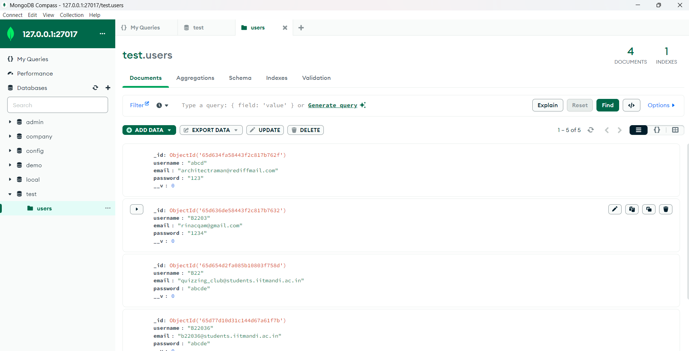
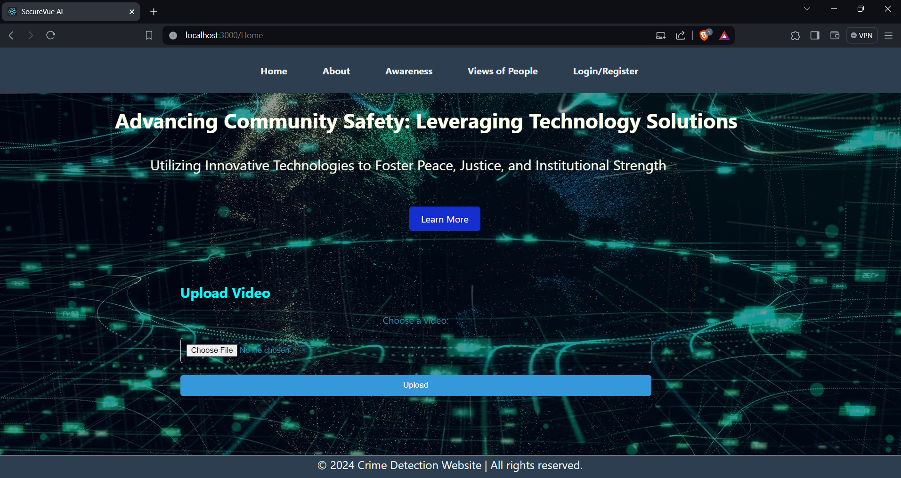

# *Google Soultion Challenge*
## SECURE VUE AI
## **SDG-16 : Peace, Justice and strong Institutions**

## **AI that senses anomalies and disasters in Cctv cameras and raise alarm leading too quick and swift action**


### Table of Contents
1. [Introduction](#introduction)
2. [Tech Stack](#tech-stack)
3. [Dataset](#dataset)
4. [Functioning of model](#functioning-of-model)
5. [Features](#features)
6. [Quick Start](#quick-start)
7. Demo (#demo)


## **Introduction**
- In response to the growing need for **proactive security measures**, our project focuses on developing an **Advanced AI model** for  **Real-Time CCTV Surveillance System** designed to swiftly **detect and report criminal activities** to the **appropriate authorities**. 
- Leveraging cutting-edge technologies such as **CNNs and LSTMs**, we aim to swiftly identify critical events like **fighting, shoplifting, abuse**, and more .
- By accurately identifying the **nature of the crime**, this system aids in directing the information to the relevant agencies, thereby enhancing the efficiency of law enforcement. 
- By **reducing crime rates** and **facilitating the prompt handling of criminal incidents**, our initiative contributes to **fostering peace within communities** and **reinforces the establishment of resilient institutions**, thus advancing the objectives of **SDG16**


## **Tech Stack**
- **Language**: Python, JavaScript
- **Model techniques**: LSTM, CNN , LRCN (Long Term Recurrent convolutional nueral network)
- **Web Framework**: ReactJS, NodeJS, ExpressJS, CSS
- **DataBase**: MongoDB, Mongoose
- **Authentication**: Firebase


## **Dataset**
- Our model's training process hinges on the comprehensive and diverse **UCF Crime Dataset**, a meticulously curated repository of **video clips** capturing various **criminal activities**. This dataset provides a rich tapestry of real-world scenarios, allowing our AI system to learn and adapt to a wide range of anomaly events. 

- By leveraging this extensive dataset, we ensure that our model is equipped to handle diverse environmental conditions, lighting variations, and behavioral patterns commonly encountered in surveillance footage. This strategic utilization of data not only enhances the robustness of our model but also instills confidence in its ability to accurately detect anomalies in real-time CCTV video streams.

- Classes:
    1) Normal Videos (150 videos)
    
    2) Anomaly Videos (400 videos)
        - Abuse (50 videos)
        - Arrest (50 videos)
        - Arson (50 videos)
        - Assault (50 videos)
        - Burglary (100 videos)
        - Explosion (50 videos)
        - Fighting (50 videos)

DataSet Link: https://www.kaggle.com/datasets/mission-ai/crimeucfdataset


## **Functioning of model**

### **Data reading**
1) **Reading Video**:
    `cv2.VideoCapture(video_path)`

2) **Skipping Few Frames**:
    `skip_frames_window = max(int(video_frames_count/SEQUENCE_LENGTH), 1)`

3) **Pre-processing steps**:
    - Resizes each frame to (64,64,3)
    - Normalize the resized frame by dividing it with 255 so that each pixel value then lies between 0 and 1
   
### **Data Pre-processing:**
  - As a crucial step in our workflow, preprocessing the video involves extracting individual frames and standardizing their dimensions for uniformity. By ensuring consistency in both height and length, we lay the foundation for accurate analysis and classification of video content.

  - Once standardized, the frames undergo classification labeling, where each frame is assigned a specific category based on its content. This classification step serves as a preliminary assessment, enabling us to organize and categorize the video frames according to the presence or absence of anomaly events.

  - By meticulously preprocessing the video data and labeling the frames, we establish a structured framework for subsequent analysis and model training. This systematic approach not only streamlines the data preparation process but also sets the stage for robust anomaly detection in CCTV videos

### **Model Structure for Crime Detection:**
**LRCN Model: Long-term Recurrent Convolutional Network**

- In our quest to build a powerful deep learning model for anomaly detection in CCTV videos, we employ the innovative **Long-term Recurrent Convolutional Network (LRCN) architecture**. This cutting-edge approach combines the strengths of **both convolutional neural networks (CNNs) and recurrent neural networks (RNNs)**, specifically utilizing LSTM (Long Short-Term Memory) units for effective temporal modeling.
  
- To implement our LRCN architecture, we will use time-distributed **`Conv2D`** layers which will be followed by **`MaxPooling2D`** and **`Dropout`** layers. The feature extracted from the **`Conv2D`** layers will be then flattened using the  **`Flatten`** layer and will be fed to a **`LSTM`** layer. The **`Dense`** layer with softmax activation will then use the output from the **`LSTM`** layer to predict the action being performed.

### **Model Training Approach**
1) Initializing **Early Stopping** for Preventing Overfitting
2) Our model is compiled using a **categorical cross-entropy loss function**, which is well-suited for multi-class classification tasks like anomaly detection. 
3) **Training Process Details**:
    - The training process spans across **70 epochs**, providing ample iterations for the model to learn from the training data. 
    - A **batch size of 14** is selected to balance computational efficiency and model stability. 
    - Additionally, **20% of the training data is reserved for validation purposes**, enabling us to assess the model's generalization capabilities during training.



### **Model Structure for Anomaly Classification**
We classified type of anomaly into these classes:

`categories_labels = {'Fighting': 0, 'Shoplifting': 1, 'Abuse': 2, 'Arrest': 3, 'Shooting': 4, 'Robbery': 5, 'Explosion': 6}`
- We combined both **Convolutional Neural Network (CNN) and Long Short-Term Memory (LSTM) models** for image classification. The CNN extracts spatial features from images, while the LSTM processes temporal sequences.
-  These outputs are concatenated and passed through a final softmax layer for classification. The CNN comprises multiple convolutional layers followed by max-pooling and dropout for feature extraction, while the LSTM includes two LSTM layers followed by a dense layer and dropout.
-  Finally, the models are combined, compiled, and trained using both CNN and LSTM inputs with corresponding callbacks for monitoring and logging training progress.
-  This method involves classifying images to identify anomalies and then creating a video comprised of these frames, where each frame is annotated with the type of anomaly detected.


## **Features**

###   React Framework (Modern Design with Glassmorphism Trend Style)
A modern and visually appealing design, incorporating the glassmorphism trend style for a sleek and contemporary appearance.

### Background Video Page
The website enhances user experience by incorporating background videos, adding a visually engaging effect to the website's background pages.


https://github.com/toshan07/Crime-Detection/assets/120120160/ead86225-6718-49c0-b085-e4f0efe17256


### Authentication
The website also includes the option to sign in using Google, implemented through Firebase authentication.

### User Registration and Login Process
For the users who do not want to use their google account for registration, the website offers the option of registrering by username and email-id.



### MongoDB data collection for login 
The website incorporates MongoDB Compass server functionality to manage user login information and maintain a database of registered user IDs.



### Community post section
Our website offers a distinctive Community Post section, empowering users to share insights and perspectives to raise awareness about crime prevention and safety measures. Users' contributions are visible in the Views section.


### About section for building safer societies
The About section provides users with information about the United Nations' Sustainable Development Goals and outlines strategies for achieving safer communities, promoting peace, and fostering justice among the general population.

### Seamless Express-Node Collaboration
The collaboration between frontend and backend has been facilitated through the utilization of tools such as ExpressJS and NodeJS, effectively bridging the gap between the two components.

### Interactive Crime Detection Results
The crime detection model's results can be connected to a new interactive page, allowing users to view the outcome of uploaded videos. Additionally, users can access displays of the frames where a crime occurs, if the uploaded video contains such content.


### Website Alarm and Notifications (Future Scope)
The future potential of the website could be expanded through the integration of an alarm system capable of notifying relevant authorities based on detected anomalies, while also alerting residents through notifications.

### Precise Anomaly Localization
The AI precisely pinpoints the exact frame within the video where an anomaly occurs, enabling quick identification and response.

### Community Engagement Platform:
 Our platform facilitates community involvement by providing a space for individuals to share insights, report suspicious activities, and collectively contribute to enhancing surveillance efforts.

### Future Integration with Society's CCTV Infrastructure
 We envision integrating our AI model with the existing CCTV infrastructure in society, thereby augmenting overall security measures and enhancing anomaly detection capabilities across various locations.

### Anomaly Categorization:
The AI system categorizes detected anomalies into distinct severity levels and contextual categories. This helps prioritize response actions and allocate resources effectively, ensuring that urgent threats are addressed promptly while minimizing disruptions for less critical deviations.

## Quick Start
Follow these steps to set up the project locally on your machine.

### Prerequisites
Make sure you have the following installed on your machine:
- [Git](https://git-scm.com/)
- [Node.js](https://nodejs.org/en)
- [npm](https://www.npmjs.com/) (Node Package Manager)

### Cloning the Repository
```bash
git clone https://github.com/toshan07/Crime-Detection
cd Crime-Detection

**Installation**

Install the project dependencies using npm:

```bash
npm install
```

Install the model packages from requirement.txt :

```bash
pip install -r requirements.txt
```

**Set Up Environment Variables**

Create a new file named `.env` in the root of your project and add the following content:

```env
GOOGLE_CLIENT_SECRET=
MONGODB_URI=
```

Replace the placeholder values with your actual credentials. You can obtain these credentials by signing up on these corresponding websites from [MongoDB](https://www.mongodb.com/). 

**Running the Project**

Open the `node_server`, then run the `index.js` file to connect to the database.
Open the `src`, then run the `Express.js` file to run the express server which is used for deploying the model.

```bash
npm run dev
```
Open [http://localhost:3000](http://localhost:3000) in your browser to view the project.

## Demo

[](https://www.youtube.com/watch?v=nJki1RElPO4)
